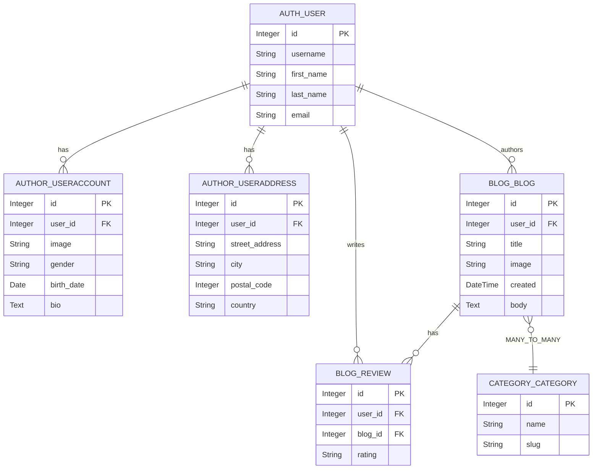
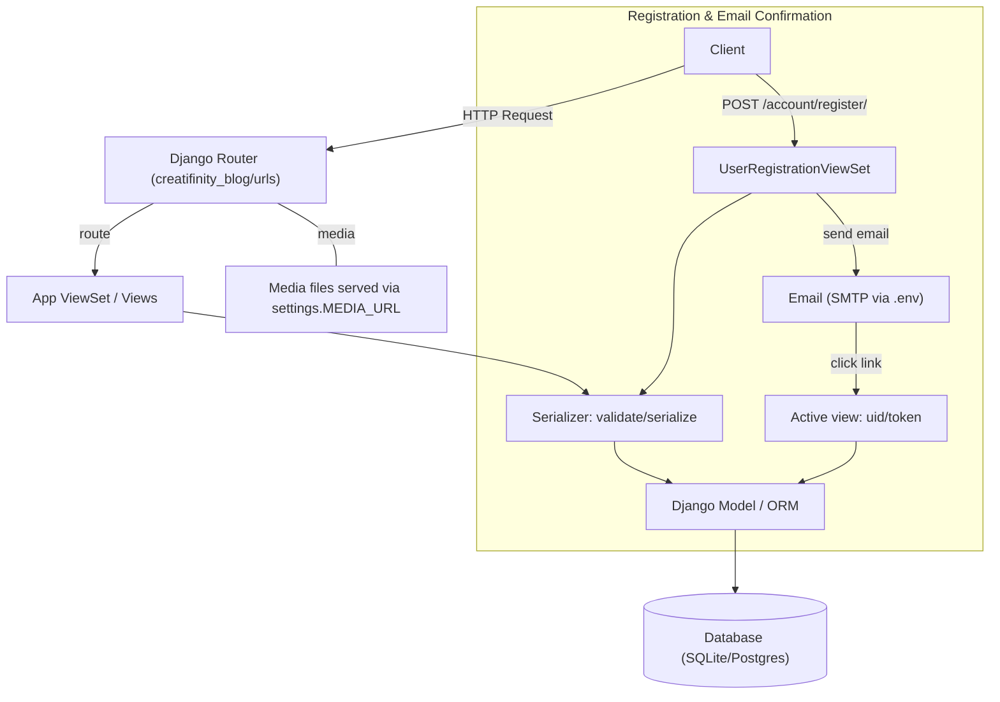

# Creatifinity REST API

A Django REST API for managing users, blog posts, categories, reviews, and contact messages.

Features
- Token authentication (DRF Token)
- User registration with email confirmation
- Blog CRUD with category tagging and reviews
- Category management
- Contact form endpoint

Quickstart (development)

1. Create and activate a virtual environment:

```bash
python -m venv my_env
source my_env/bin/activate
```

2. Install dependencies:

```bash
python -m pip install --upgrade pip setuptools wheel
python -m pip install -r requirements.txt
```

3. Create `.env` in project root with at least:

```
EMAIL=you@example.com
EMAIL_PASSWORD=yourpassword
EMAIL_HOST=smtp.gmail.com
EMAIL_PORT=587
```

4. Migrate and run:

```bash
python manage.py migrate
python manage.py runserver
```

API endpoints (overview)
- `/` — Root router listing users (`user`) and other registered viewsets
- `/account/` — Account, registration, login, logout endpoints
- `/blog/` — Blog list (`list/`) and reviews (`review/`)
- `/category/` — Category list (`list/`)
- `/contact_us/` — Contact form (`list/`)

See `docs/` for full architecture, ER diagram, flowcharts, and API reference.

Deployment
- Use a production-ready database (Postgres) and configure `DATABASES` in `creatifinity_blog/settings.py`.
- Set `DEBUG=False` and configure allowed hosts and email credentials via `.env`.
- For Vercel deployment, add environment variables in the Vercel dashboard or with the Vercel CLI.
- Run `python manage.py collectstatic --noinput` during build so WhiteNoise can serve static assets.

Vercel deployment steps
1. Install the Vercel CLI locally: `npm install -g vercel`
2. Initialize the project in the repo root: `vercel`
3. Set env vars in Vercel or with CLI:
   - `SECRET_KEY`
   - `DEBUG=False`
   - `DATABASE_URL` (Postgres connection string)
   - `ALLOWED_HOSTS=your-app-name.vercel.app`
   - `CORS_ALLOWED_ORIGINS=https://your-app-name.vercel.app`
   - `VERCEL_URL=your-app-name.vercel.app`
4. Push to GitHub and let Vercel deploy automatically.

> Note: Vercel is serverless and the local `media/` folder is ephemeral in production. For persistent uploads, use a storage provider such as S3, Google Cloud Storage, or Cloudinary.

License & Contact
Contact the project owner for license and contributions.

Database ER diagram



Project Flowchart



